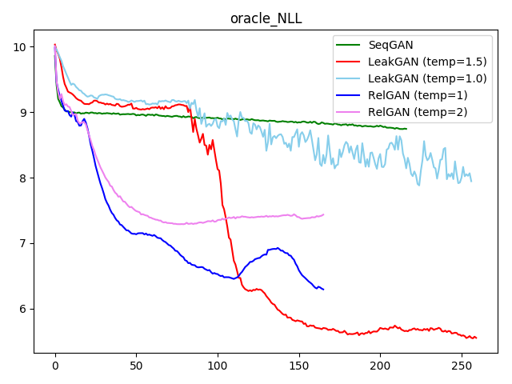
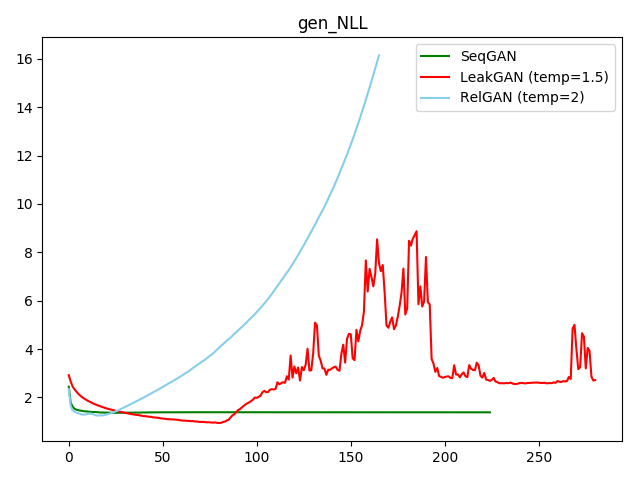
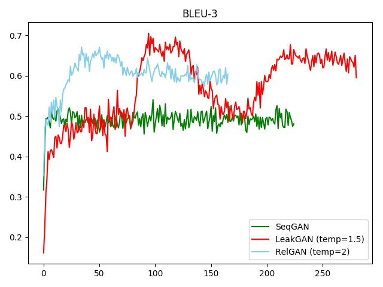

# TextGAN-PyTorch

TextGAN is a PyTorch framework for Generative Adversarial Networks (GANs) based text generation models. TextGAN serves as a benchmarking platform to support research on GAN-based text generation models. Since most GAN-based text generation models are implemented by Tensorflow, TextGAN can help those who get used to PyTorch to enter the text generation field faster.

For now, only few GANs-based models are implemented, including [SeqGAN (Yu et. al, 2017)](https://arxiv.org/abs/1609.05473), [LeakGAN (Guo et. al, 2018)](https://arxiv.org/abs/1709.08624) and [RelGAN (Nie et. al, 2018)](https://openreview.net/forum?id=rJedV3R5tm). If you find any mistake in my implementation, please let me know! Also, please feel free to contribute to this repository if you want to add other models.

## Requirements

- PyTorch >= 1.0.0
- Python 3.6
- Numpy 1.14.5
- CUDA 7.5+ (For GPU)
- nltk 3.4
- tqdm 4.32.1

To install, run `pip install -r requirements.txt`. In case of CUDA problems, consult the official PyTorch [Get Started guide](https://pytorch.org/get-started/locally/).

## Implemented Models and Original Papers

- **SeqGAN** - [SeqGAN: Sequence Generative Adversarial Nets with Policy Gradient](https://arxiv.org/abs/1609.05473)
- **LeakGAN** - [Long Text Generation via Adversarial Training with Leaked Information](https://arxiv.org/abs/1709.08624)
- **RelGAN** - [RelGAN: Relational Generative Adversarial Networks for Text Generation](https://openreview.net/forum?id=rJedV3R5tm)

## Get Started

- Get Started

```bash
git clone https://github.com/williamSYSU/TextGAN-PyTorch.git
cd TextGAN-PyTorch
```

- For real data experiments, `Image COCO` and `EMNLP news` dataset can be downloaded from [here](https://drive.google.com/drive/folders/1XvT3GqbK1wh3XhTgqBLWUtH_mLzGnKZP?usp=sharing). 
- Run with `SeqGAN`

```bash
cd run
python3 run_seqgan.py 0 0	# The first 0 is job_id, the second 0 is gpu_id
```

- Run with `LeakGAN`

```bash
cd run
python3 run_leakgan.py 0 0
```

- Run with `RelGAN`

```bash
cd run
python3 run_relgan.py 0 0
```

## Features

1. **Instructor**

   For each model, the entire runing process is defined in `instructor/oracle_data/seqgan_instructor.py`. (Take SeqGAN in Synthetic data experiment for example). Some basic functions like `init_model()`and `optimize()` are defined in the base class `BasicInstructor` in `instructor.py`. If you want to add a new GAN-based text generation model, please create a new instructor under `instructor/oracle_data` and define the training process for the model.

2. **Visualization**
   
   Use `utils/visualization.py` to visualize the log file, including model loss and metrics scores. Custom your log files in `log_file_list`, no more than `len(color_list)`. The log filename should exclude `.txt`.
   
3. **Logging**

   The TextGAN-PyTorch use the `logging` module in Python to record the running process, like generator's loss and metric scores. For the convenience of visualization, there would be two same log file saved in `log/log_****_****.txt` and `save/**/log.txt` respectively. Furthermore, The code would automatically save the state dict of models and a batch-size of generator's samples in `./save/**/models` and `./save/**/samples` per log step, where `**` depends on your hyper-parameters.
   
4. **Running Signal**

   You can easily control the training process with the class `Signal` (please refer to `utils/helpers.py`) based on dictionary file `run_signal.txt`.

   For using the `Signal`, just edit the local file `run_signal.txt` and set `pre_sig` to `Fasle` for example, the program will stop pre-training process and step into next training phase. It is convenient to early stop the training if you think the current training is enough.

5. **Automatiaclly select GPU**

   In `config.py`, the program would automatically select a GPU device with the least `GPU-Util` in `nvidia-smi`. This feature is enabled by default. If you want to manually select a GPU device, please uncomment the `--device` args in `run_[run_model].py` and specify a GPU device with command.

## Reproduction Results

 Please note the log step of each model is different. See `run_[run_model].py` for details of log step.

### Synthetic data:  Oracle data

- NLL_oracle

  > LeakGAN suprisely outperforms RelGAN due to its temperature control, but LeakGAN’s samples suffered from severe mode collapse.
  >
  > Though both LeakGAN and RelGAN would suffer from mode collapse, the pattern of collapse is different. LeakGAN will generate a sentence with only a few words. RelGAN will generate repeated sentences with different words.

  

- NLL_gen

  

### Real data: Image COCO data

- BLEU-3​

  

- NLL_gen

  

## TODO

- [x] Add Experiment Results
- [x] Fix bugs in `LeakGAN` model
- [x] Add instructors of `SeqGAN` and `LeakGAN` in `instrutor/real_data`
- [ ] Fix logging bugs for `save_root`
- [ ] Fix issues of $NLL_{oracle}$ in `SeqGAN` model
