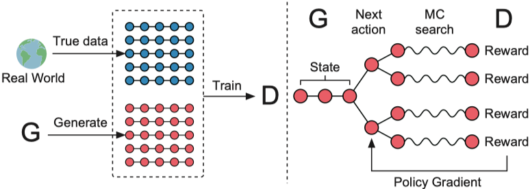
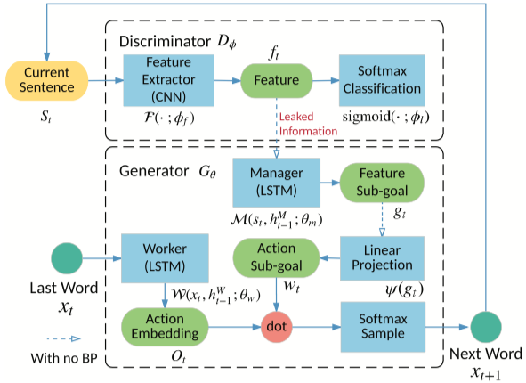
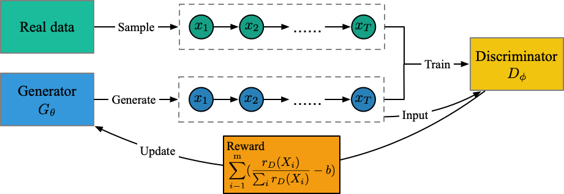
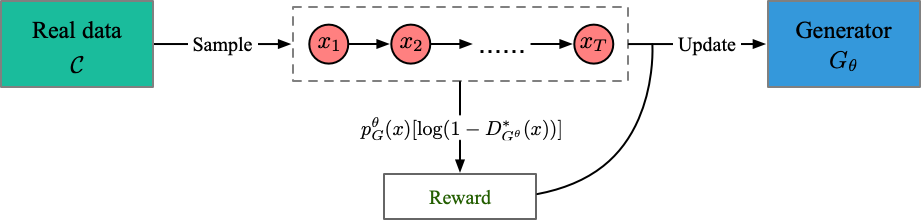
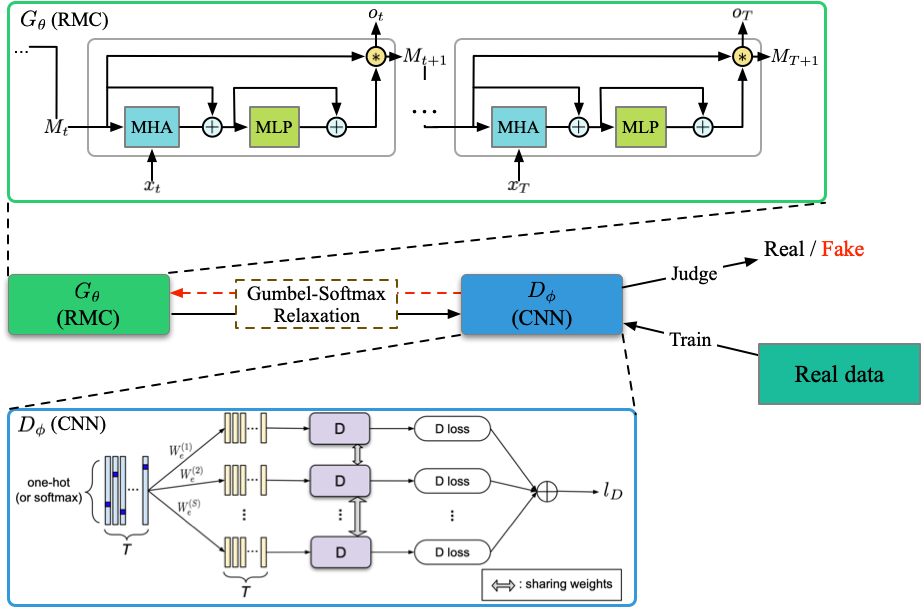
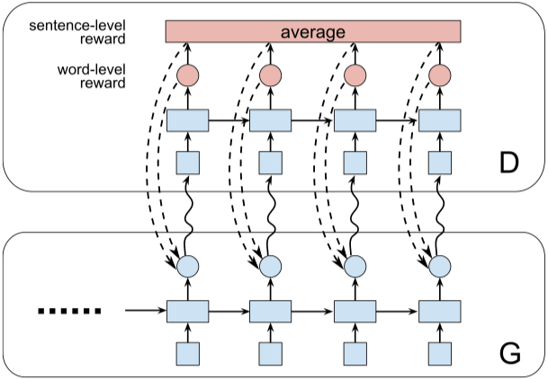
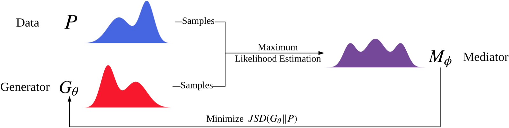
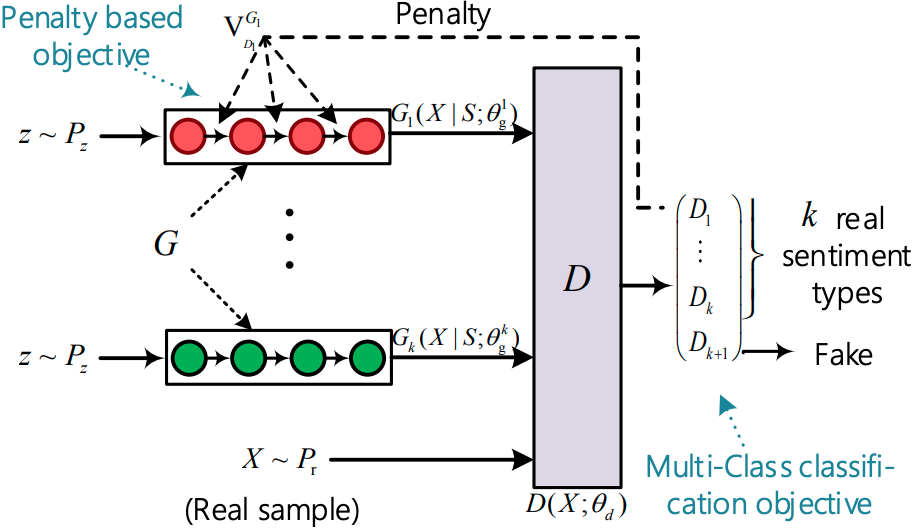
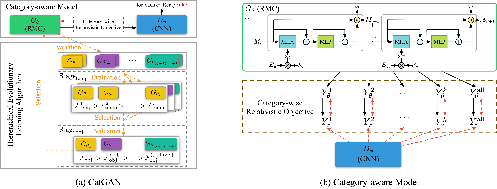

# TextGAN-PyTorch

TextGAN is a PyTorch framework for Generative Adversarial Networks (GANs) based text generation models, including general text generation models and category text generation models. TextGAN serves as a benchmarking platform to support research on GAN-based text generation models. Since most GAN-based text generation models are implemented by Tensorflow, TextGAN can help those who get used to PyTorch to enter the text generation field faster.

If you find any mistake in my implementation, please let me know! Also, please feel free to contribute to this repository if you want to add other models.


## Requirements

- **PyTorch >= 1.1.0**
- Python 3.6
- Numpy 1.14.5
- CUDA 7.5+ (For GPU)
- nltk 3.4
- tqdm 4.32.1
- KenLM (https://github.com/kpu/kenlm)

To install, run `pip install -r requirements.txt`. In case of CUDA problems, consult the official PyTorch [Get Started guide](https://pytorch.org/get-started/locally/).

## KenLM Installation

- Download stable release and unzip: http://kheafield.com/code/kenlm.tar.gz

- Need Boost >= 1.42.0 and bjam

  - Ubuntu: `sudo apt-get install libboost-all-dev`
  - Mac: `brew install boost; brew install bjam`

- Run *within* kenlm directory:

  ```bash
  mkdir -p build
  cd build
  cmake ..
  make -j 4
  ```

- `pip install https://github.com/kpu/kenlm/archive/master.zip`

- For more information on KenLM see: https://github.com/kpu/kenlm and http://kheafield.com/code/kenlm/

## Implemented Models and Original Papers

### General Text Generation

- **SeqGAN** - [SeqGAN: Sequence Generative Adversarial Nets with Policy Gradient](https://arxiv.org/abs/1609.05473)
- **LeakGAN** - [Long Text Generation via Adversarial Training with Leaked Information](https://arxiv.org/abs/1709.08624)
- **MaliGAN** - [Maximum-Likelihood Augmented Discrete Generative Adversarial Networks](https://arxiv.org/abs/1702.07983)
- **JSDGAN** - [Adversarial Discrete Sequence Generation without Explicit Neural Networks as Discriminators](http://proceedings.mlr.press/v89/li19g.html)
- **RelGAN** - [RelGAN: Relational Generative Adversarial Networks for Text Generation](https://openreview.net/forum?id=rJedV3R5tm)
- **DPGAN** - [DP-GAN: Diversity-Promoting Generative Adversarial Network for Generating Informative and Diversified Text](https://arxiv.org/abs/1802.01345)
- **DGSAN** - [DGSAN: Discrete Generative Self-Adversarial Network](https://arxiv.org/abs/1908.09127)
- **CoT** - [CoT: Cooperative Training for Generative Modeling of Discrete Data](https://arxiv.org/abs/1804.03782)

### Category Text Generation

- **SentiGAN** - [SentiGAN: Generating Sentimental Texts via Mixture Adversarial Networks](https://www.ijcai.org/proceedings/2018/618)
- **CatGAN** (ours) - [CatGAN: Category-aware Generative Adversarial Networks with Hierarchical Evolutionary Learning for Category Text Generation](https://arxiv.org/abs/1911.06641)

## Get Started

- Get Started

```bash
git clone https://github.com/williamSYSU/TextGAN-PyTorch.git
cd TextGAN-PyTorch
```

- For real data experiments, all datasets (`Image COCO`, `EMNLP NEWs`, `Movie Review`, `Amazon Review`) can be downloaded from [here](https://drive.google.com/drive/folders/1XvT3GqbK1wh3XhTgqBLWUtH_mLzGnKZP?usp=sharing). 
- Run with a specific model

```bash
cd run
python3 run_[model_name].py 0 0	# The first 0 is job_id, the second 0 is gpu_id

# For example
python3 run_seqgan.py 0 0
```

## Features

1. **Instructor**

   For each model, the entire runing process is defined in `instructor/oracle_data/seqgan_instructor.py`. (Take SeqGAN in Synthetic data experiment for example). Some basic functions like `init_model()`and `optimize()` are defined in the base class `BasicInstructor` in `instructor.py`. If you want to add a new GAN-based text generation model, please create a new instructor under `instructor/oracle_data` and define the training process for the model.

2. **Visualization**
   
   Use `utils/visualization.py` to visualize the log file, including model loss and metrics scores. Custom your log files in `log_file_list`, no more than `len(color_list)`. The log filename should exclude `.txt`.
   
3. **Logging**

   The TextGAN-PyTorch use the `logging` module in Python to record the running process, like generator's loss and metric scores. For the convenience of visualization, there would be two same log file saved in `log/log_****_****.txt` and `save/**/log.txt` respectively. Furthermore, The code would automatically save the state dict of models and a batch-size of generator's samples in `./save/**/models` and `./save/**/samples` per log step, where `**` depends on your hyper-parameters.
   
4. **Running Signal**

   You can easily control the training process with the class `Signal` (please refer to `utils/helpers.py`) based on dictionary file `run_signal.txt`.

   For using the `Signal`, just edit the local file `run_signal.txt` and set `pre_sig` to `Fasle` for example, the program will stop pre-training process and step into next training phase. It is convenient to early stop the training if you think the current training is enough.

5. **Automatiaclly select GPU**

   In `config.py`, the program would automatically select a GPU device with the least `GPU-Util` in `nvidia-smi`. This feature is enabled by default. If you want to manually select a GPU device, please uncomment the `--device` args in `run_[run_model].py` and specify a GPU device with command.

## Implementation Details

### SeqGAN

- run file: [run_seqgan.py](run/run_seqgan.py)

- Instructors: [oracle_data](instructor/oracle_data/seqgan_instructor.py), [real_data](instructor/real_data/seqgan_instructor.py)

- Models: [generator](models/SeqGAN_G.py), [discriminator](models/SeqGAN_D.py)

- Structure (from [SeqGAN](https://arxiv.org/pdf/1609.05473.pdf))

  

### LeakGAN

- run file: [run_leakgan.py](run/run_leakgan.py)

- Instructors: [oracle_data](instructor/oracle_data/leakgan_instructor.py), [real_data](instructor/real_data/leakgan_instructor.py)

- Models: [generator](models/LeakGAN_G.py), [discriminator](models/LeakGAN_D.py)

- Structure (from [LeakGAN](https://arxiv.org/pdf/1709.08624.pdf))

  

### MaliGAN

- run file: [run_maligan.py](run/run_maligan.py)

- Instructors: [oracle_data](instructor/oracle_data/maligan_instructor.py), [real_data](instructor/real_data/maligan_instructor.py)

- Models: [generator](models/MaliGAN_G.py), [discriminator](models/MaliGAN_D.py)

- Structure (from my understanding)

  

### JSDGAN

- run file: [run_jsdgan.py](run/run_jsdgan.py)

- Instructors: [oracle_data](instructor/oracle_data/jsdgan_instructor.py), [real_data](instructor/real_data/jsdgan_instructor.py)

- Models: [generator](models/JSDGAN_G.py) (No discriminator)

- Structure (from my understanding)

  

### RelGAN

- run file: [run_relgan.py](run/run_relgan.py)

- Instructors: [oracle_data](instructor/oracle_data/relgan_instructor.py), [real_data](instructor/real_data/relgan_instructor.py)

- Models: [generator](models/RelGAN_G.py), [discriminator](models/RelGAN_D.py)

- Structure  (from my understanding)

  
  
### DPGAN

- run file: [run_dpgan.py](run/run_dpgan.py)

- Instructors: [oracle_data](instructor/oracle_data/dpgan_instructor.py), [real_data](instructor/real_data/dpgan_instructor.py)

- Models: [generator](models/DPGAN_G.py), [discriminator](models/DPGAN_D.py)

- Structure  (from [DPGAN](https://arxiv.org/abs/1802.01345))

  
  
### DGSAN

- run file: [run_dgsan.py](run/run_dgsan.py)

- Instructors: [oracle_data](instructor/oracle_data/dgsan_instructor.py), [real_data](instructor/real_data/dgsan_instructor.py)

- Models: [generator](models/DGSAN_G.py), [discriminator](models/DGSAN_D.py)

### CoT

- run file: [run_cot.py](run/run_cot.py)

- Instructors: [oracle_data](instructor/oracle_data/cot_instructor.py), [real_data](instructor/real_data/cot_instructor.py)

- Models: [generator](models/CoT_G.py), [discriminator](models/CoT_D.py)

- Structure  (from [CoT](https://arxiv.org/abs/1804.03782))

  

### SentiGAN

- run file: [run_sentigan.py](run/run_sentigan.py)

- Instructors: [oracle_data](instructor/oracle_data/sentigan_instructor.py), [real_data](instructor/real_data/sentigan_instructor.py)

- Models: [generator](models/SentiGAN_G.py), [discriminator](models/SentiGAN_D.py)

- Structure (from [SentiGAN](https://www.ijcai.org/proceedings/2018/0618.pdf))

  

### CatGAN

- run file: [run_catgan.py](run/run_catgan.py)

- Instructors: [oracle_data](instructor/oracle_data/catgan_instructor.py), [real_data](instructor/real_data/catgan_instructor.py)

- Models: [generator](models/CatGAN_G.py), [discriminator](models/CatGAN_D.py)

- Structure (from [CatGAN](https://arxiv.org/abs/1911.06641))

  

  

## Licence

**MIT lincense**

